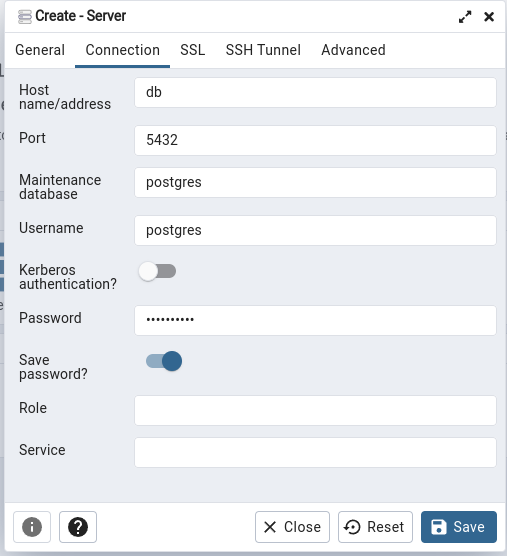
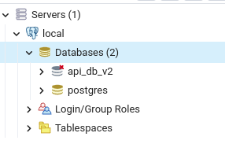

# API Valorant

Steps to run this project:

1. Run `npm i` command
2. Run `docker-compose up` command
3. Run `npm start` command

## Ambiente DEV

### Requisitos

- docker
- docker-compose
- Arquivo .env definido, modelo em env.sample

### Servicos disponibilizados pelo docker-compose

1. Postgres 14
2. API
3. PGAdmin

### Para fazer um build completo do ambiente e subir a nova versão
1. docker-compose build --no-cache
2. docker-compose up -d

### Para acessar o PGAdmin4

1. Porta -> 18080
2. Usuario e senha -> definidos no docker-compose

 - Cadastre o servidor como db e os dados de acesso serão os mesmos descritos no arquivo .env

